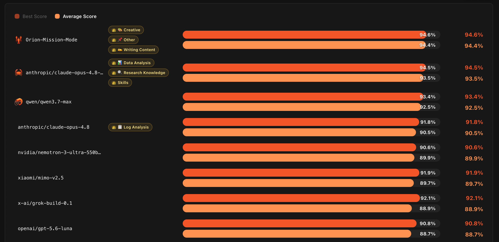

<p align="center">
  
</p>

<h1 align="center">百度AI搜索 — 任务化模式</h1>

<p align="center">
  <strong>下一代智能搜索范式：从「给答案」到「交结果」</strong>
</p>

---

<p align="center">
  <a href="https://pinchibench-web.vercel.app/">
    
  </a>
  
  
</p>

<!-- <p align="center">
  
</p> -->

<p align="center">
  <strong><a href="https://wenxin.baidu.com">官方网站</a></strong>
  &nbsp;|&nbsp;
  <strong><a href="https://pinchibench-web.vercel.app/">PinchBench榜单</a></strong>
  &nbsp;|&nbsp;
  <strong><a href="https://github.com/Baidu-AI-Search/Orion-Mission-Mode/blob/main/illustration.md">评估说明</a></strong>
  &nbsp;|&nbsp;
  <strong><a href="[Issues链接占位]">功能建议</a></strong>
</p>

<!-- <p align="center">
  <strong><a href="[文档链接占位]">技术文档</a></strong>
</p> -->

---

## 产品介绍

**百度AI搜索任务化模式**是百度搜索在AI时代的重大范式升级，标志着搜索引擎从传统信息检索系统向智能任务执行平台的全面转型。依托百度在搜索、大模型、知识图谱领域十余年的技术积累，结合自研文心大模型与端云协同Harness执行引擎，任务化模式让用户只需用自然语言描述目标，系统即可自动完成任务拆解、多步推理、工具调度与端到端结果交付。

与传统RAG（检索增强生成）式AI搜索仅能从检索文档中合成答案不同，任务化模式构建了完整的多智能体协作架构，能够跨工具、跨服务执行复杂的多步工作流，真正实现从「百度一下，你就知道」到「百度一下，你就做到」的体验升级。

**官方定位**：AI时代的通用智能任务执行平台

| 核心指标 | 数据 |
|---------|------|
| AI搜索月活跃用户 | --亿 |
| 接入MCP服务能力 | -- |
| 覆盖场景 | 办公、研究、创作、开发、生活服务等 |
| 安全认证 | 信通院复杂任务规划执行、可信能力双项最高等级 |
| 更新节奏 | 每周迭代一版 |

---

## 核心能力

### 🎯 意图理解与任务拆解
自动理解用户模糊、复杂的自然语言指令，将高层目标拆解为结构化的有向无环图（DAG）任务工作流，无需用户手动提炼关键词或编排执行步骤。

### 🔧 多工具协同调度
内置完善的工具体系，包括但不限于：
- **深度搜索引擎** — 跨平台语义检索与高价值信息精准定位
- **代码解释器** — 数据分析、文件处理、自动化脚本执行
- **文档生成** — 自动报告撰写、演示文稿制作、电子表格处理
- **浏览器自动化** — 网页导航、信息提取、表单提交
- **MCP生态接入** — 通过模型上下文协议接入多种第三方服务能力

### ⚡ 端云协同Harness架构
- **隐私本地执行** — 敏感操作在本地沙箱内完成，保障数据安全
- **云端规模推理** — 复杂推理任务自动调度云端算力，无需手动切换
- **上下文按需组装** — 根据任务语义与用户历史精准注入相关背景信息，减少冗余干扰
- **持续迭代优化** — 基于历史执行轨迹不断优化执行路径，让不同模型均能稳定运行于能力上限

### 🔒 企业级安全可信
- 本地沙箱隔离，文件夹级权限精细管控
- 高危操作二次确认机制
- 通过中国信通院复杂任务规划执行、可信能力双项认证，均获最高等级
- 数据防泄漏、行为审计、可观测性全链路保障

---

## PinchBench Benchmark 介绍

### 关于PinchBench

**PinchBench**是由Kilo AI团队推出、OpenClaw社区维护的权威智能体（Agent）评测基准，是目前业界公认最能体现智能体真实工作能力的「实战考场」。与传统大模型基准（如MMLU、GPQA等「知识测验」）不同，PinchBench采用「任务级」评测哲学——不考核模型会不会答题，只检验智能体能否真正完成整件工作并交付可验证的结果。

PinchBench提供LLM无关的标准化评测框架，统一工具集、上下文管理和工具调用协议，实现不同模型与智能体框架之间的公平横向对比。

<!-- ### 评测维度

PinchBench从三个核心维度对智能体进行综合评估：

| 维度 | 说明 |
|------|------|
| **任务成功率** | 任务是否完整闭环，交付物是否达到预期质量标准 |
| **执行速度** | 从接收指令到完成交付的端到端耗时 |
| **推理成本** | 完成单个任务的平均Token消耗成本 | -->

### 任务覆盖范围

当前版本PinchBench包含**23个真实工作场景、147项任务**，覆盖以下类别：

| 类别 | 代表任务 |
|------|---------|
| 📊 数据分析 | 数据清洗、统计计算、可视化图表生成 |
| 📝 研究写作 | 资料检索、报告撰写、内容综合整理 |
| 💻 开发与DevOps | 代码编写、调试运行、环境配置 |
| 📧 办公自动化 | 邮件处理、日程管理、会议纪要生成 |
| 📄 文档处理 | PDF解析、格式转换、模式校验 |
| 🌐 网络操作 | 网页浏览、信息提取、API交互 |
| 🖼️ 多媒体处理 | 图片操作、媒体片段处理 |

### 评分机制

PinchBench采用**自动化检查 + LLM评审**的双轨评分机制：
- **自动化评分** — 通过脚本直接验证可量化结果（文件是否生成、格式是否正确、数值是否准确）
- **LLM评审** — 由权威大模型对内容质量、逻辑完整性、专业度进行评分
- **混合评分** — 加权结合两种方式，兼顾客观性与质量评估

---

## 评测结果

### 🏆 全球第一

**2026年7月17日**，百度AI搜索任务化模式正式登顶PinchBench全球榜首，以 94.6% 综合成功率、94.4% 平均得分拿下榜单第一，综合实力全面超越 Anthropic Claude、英伟达 Nemotron、OpenAI GPT、小米 Mimo、通义千问等海内外主流大模型，成为**首个以正式产品身份获得PinchBench总榜第一的国产智能体系统**。

### 成绩对比

在PinchBench公开评测中，百度AI搜索任务化模式与主流模型/框架的成绩对比如下：

| 排名 | 系统/模型 | 评分 |
|:----:|-----------|:----------:|
| 🥇 **1** | **百度AI搜索** | **94.4%** |
| 🥈 2 | anthropic/claude-opus-4.8-fast | 93.5% |
| 3 | qwen/qwen3.7-max | 92.5% |
| 4 | anthropic/claude-opus-4.8 | 90.5% |

> **关键发现**：百度AI搜索执行框架将模型任务评估得分提升至94%以上，证明**优秀的系统架构与工程实现能够显著释放模型潜力**。

<!-- ### 双榜冠军

除PinchBench外，百度AI搜索任务化模式在另一项权威评测中同样折桂：

- **DeepResearch Bench 第一名**（综合得分58.03）
  - 评测维度：洞察深度、事实准确性、内容可读性、结构化程度
  - 技术支撑：自研Deep Search + Deep Research双引擎架构 -->

### 详细评测结果与典型 Case

为了保证评测的透明度与可追溯性，我们对 147 个真实工作场景任务的评估结果进行了全量开源。我们的系统在各大核心业务流中均表现出顶级的任务闭环能力。

#### 📊 按核心场景能力表现

在 PinchBench 评测中，任务化模式在内容创作、创意生成等多项核心指标上**斩获全球第一**。系统能力覆盖以下重点工作流（注：部分复杂任务跨越多个领域，数量存在重叠）：

| 任务场景分类 | 任务数量 | 综合得分 | 典型应用范例 | 榜单表现 |
|:---|:---:|:---:|:---|:---:|
| **内容创作 (Writing Content)** | 12 | **96.8%** | 博客文章撰写、长文总结、README生成、文案重写 | 🥇 **全球第一** |
| **创意与多媒体 (Creative)** | 3 | **87.5%** | AI 图像生成、图像识别分类、创意类工作流 | 🥇 **全球第一** |
| **其他综合任务 (Other)** | 52 | - | 覆盖更多细分长尾工作流场景 | 🥇 **全球第一** |
| **数据与财务分析 (Data Analysis)** | 32 | **96.2%** | CSV/表格数据处理、市场分析、财报与金融数据挖掘 | - |
| **核心智能体能力 (Core Agent)** | 9 | **96.2%** | 意图健全性检查、记忆提取、文件操作、工作流理解 | - |
| **代码与开发运维 (Code DevOps)** | 15 | **93.0%** | 编码、自动化脚本、CI/CD流水线、K8s/Docker、测试与重构 | - |
| **安全与异常排查 (Security)** | 3 | **91.1%** | 安全漏洞 (CVE) 评级分类、日志异常检测、GitHub Issue 追踪 | - |
| **办公与生产力 (Productivity)** | 13 | **90.3%** | 日程日历管理、邮件批处理、待办事项整理、每日工作简报 | - |
| **研究与知识获取 (Research Knowledge)** | 14 | **79.5%** | 竞品与市场调研、信息检索、合同法务分析、前沿技术追踪 | - |

*(注：以上大类基于 147 个 Case 的 `category` 聚合统计得出)*

#### 🌟 高光任务展示

以下选取了部分具有代表性的极高难度任务，展示百度AI搜索任务化模式在真实工作流中的思考深度与执行质量（点击任务名称可查看详细评分与亮点评估）：

*   **[浏览器自动化测试编写 (Browser Automation)](./results/case_browser_automation.md)**
    *   **能力维度**: 代码工程 / 复杂系统理解
    *   **综合得分**: 1.0 / 1.0 (12 项评估维度全满分)
    *   **评审亮点**: 展现了极强的“先理解再行动”的工程素养。系统能主动阅读 HTML 分析 DOM 结构，编写出不仅符合 Playwright 最佳实践，且包含严谨金额断言的端到端测试脚本。
*   **[MapReduce 日志时间线可视化 (Log Timeline Analysis)](./results/case_mapreduce_log.md)**
    *   **能力维度**: 深度洞察 / 复杂日志处理
    *   **综合得分**: 1.0 / 1.0 (15 项评估维度全满分)
    *   **评审亮点**: 对底层系统日志的极致解析。不仅能精确到毫秒级还原 27 条事件时间线，还自动生成了 ASCII Gantt 图展示并行任务，并针对性提出了底层性能优化建议。
*   **[BYOK 安全最佳实践指南撰写 (Security Best Practices)](./results/case_byok_guide.md)**
    *   **能力维度**: 长文写作 / 行业深度研究
    *   **综合得分**: 0.95 / 1.0 (生产级可用文档)
    *   **评审亮点**: 输出了长达 5800 字的专业安全指南。精准对齐主流大模型厂商（OpenAI, Anthropic 等）的底层 API 差异，指出了 10 个极易踩坑的安全陷阱，并附带可运行的代码级防护方案。

#### 📂 全量 147 项评估结果明细

<details>
<summary><b>点击展开查看所有 147 个评测任务的 JSON 结果概览</b></summary>
<br>

点击查看官方完整任务描述：[👉 打开 PinchBench 官方 GitHub 仓库](https://github.com/pinchbench/skill/tree/main/tasks)

您可以直接查看开源的完整评测数据文件：[👉 点击查看完整 147_cases_evaluation.json 原始文件](./results/147_cases_evaluation.json)

以下为部分测试用例的简报：

| 任务 ID | 任务名称 | 评分 | 耗时(秒) | 亮点评价提取 |
|:---|:---|:---:|:---:|:---|
| `task_csv_pension_liability` | US Pension Fund Liability Analysis | 1.0 | 322s | 计算精准，财务洞察深刻，排版极佳 |
| `task_log_hdfs_slow_ops` | HDFS DataNode Log - Slow Operation Detection | 1.0 | 488s | 提供了相关性分析与 4 项可落地的优化建议 |
| `task_byok_best_practices` | BYOK Best Practices for AI Inference | 0.95 | 560s | 覆盖主流云厂商，指出 10 个具体坑点与权衡 |
| `task_meeting_council_budget` | Tampa City Council – Extract Budget Discussions | 0.95 | 361s | 从长文本中无遗漏提取 29 个财务款项 |

*(为保证可读性，此处仅展示部分列表。完整细节请查阅 [JSON 源文件](./results/147_cases_evaluation.json))*

</details>

---

## 榜单展示

<p align="center">
  
  <br/>
  <em>图1：PinchBench全球排行榜</em>
</p>

<!-- <p align="center">
  
  <br/>
  <em>图1：PinchBench全球排行榜</em>
</p> -->

---

## 快速链接

| 资源 | 链接 |
|------|------|
| 🌐 **PinchBench官方网站** | <a href="https://pinchibench-web.vercel.app/">网站</a> |
| 📖 **技术白皮书** | <a href="https://github.com/gzq17/benchmark_public/blob/main/illustration.md">白皮书（待修改）</a> |
| 🚀 **产品体验入口** | <a href="https://wenxin.baidu.com">百度AI搜索</a> |
<!-- | 👨‍💻 **开发者文档** | [开发者文档链接占位] |
| 📋 **更新日志** | [更新日志占位] | -->
<!-- | 🛡️ **安全与可信说明** | [安全说明占位] | -->

---

## pinchbench评估适配说明

> **在进行pinchbench测试时，对相关的44个任务进行了评估适配，详情见<a href="https://github.com/Baidu-AI-Search/Orion-Mission-Mode/blob/main/illustration.md">评估说明</a>**

---

## 架构概览

```
┌─────────────────────────────────────────────────────────────┐
│                    百度AI搜索 · 任务化模式                    │
├─────────────────────────────────────────────────────────────┤
│  ┌─────────┐    ┌──────────┐    ┌──────────┐    ┌────────┐  │
│  │ 指挥官  │───▶│  规划师  │───▶│  执行者  │───▶│  整合者 │  │
│  │ Master  │    │ Planner  │    │ Executor │    │ Writer │  │
│  └─────────┘    └──────────┘    └──────────┘    └────────┘  │
│                                                             │
│  ┌─────────────────────────────────────────────────────┐    │
│  │                  端云协同Harness引擎                 │    │
│  │  ┌─────────────┐    ┌─────────────────────────┐    │    │
│  │  │  本地沙箱   │◀──▶│     云端推理集群        │    │    │
│  │  │ (隐私执行)  │    │  (文心+第三方大模型)    │    │    │
│  │  └─────────────┘    └─────────────────────────┘    │    │
│  └─────────────────────────────────────────────────────┘    │
│                                                             │
│  ┌─────────────────────────────────────────────────────┐    │
│  │                     技能库                           │    │
│  │  深度搜索 │ 深度研究 │ 代码执行 │ 文档生成 │ ...... │    │
│  └─────────────────────────────────────────────────────┘    │
└─────────────────────────────────────────────────────────────┘
```

1. **指挥官（Master）** — 分析查询复杂度，路由至合适的工作流
2. **规划师（Planner）** — 将复杂任务拆解为可执行的DAG工作流
3. **执行者（Executor）** — 调用合适的工具完成各项子任务
4. **整合者（Writer）** — 将执行结果综合为结构化、可交付的最终输出

---

<!-- ## 引用格式

如果您在研究或评测中参考了本项目的PinchBench成绩，请使用以下格式引用：

```bibtex
@misc{baidu2026taskmode,
  author       = {{百度AI搜索团队}},
  title        = {百度AI搜索任务化模式：智能搜索新范式},
  year         = {2026},
  howpublished = {\url{[GitHub仓库链接占位]}},
  note         = {2026年5月PinchBench全球排行榜第一名}
}
```

--- -->

<!-- ## 社区与支持

- **GitHub Issues** — 问题反馈与功能建议 [[链接占位]]
- **开发者社区** — 技术交流与社区支持 [[链接占位]]
- **商务合作** — 企业部署与商务洽谈 [[邮箱占位]]

--- -->

## 版权说明

百度AI搜索任务化模式是百度公司的专有产品。

---

<p align="center">
  <sub>由百度AI搜索团队匠心打造 ❤️</sub>
  <br/>
  <sub>© 2026 百度公司 版权所有</sub>
</p>
