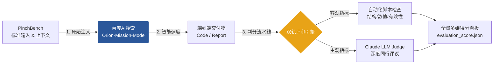

<p align="center">
  
</p>

---

<h2 align="center">百度AI搜-任务化模式 Pinchbench 结果</h2>

<p align="center">
  <a href="https://pinchbench-web.vercel.app/">
    
  </a>
  <a href="./results/147_cases_evaluation.json">
    
  </a>
  <a href="https://github.com/pinchbench/skill/tree/main/tasks">
    
  </a>
</p>


<p align="center">
  <strong><a href="https://wenxin.baidu.com">产品入口</a></strong>
  &nbsp;|&nbsp;
  <strong><a href="https://pinchbench-web.vercel.app/">PinchBench榜单</a></strong>
  &nbsp;|&nbsp;
  <strong><a href="./illustration.md">评估说明</a></strong>
  &nbsp;|&nbsp;
  <strong><a href="./results/147_cases_evaluation.json">详细结果</a></strong>
</p>


---

## 评测流程与详细结果

### 🔬 标准化评估体系与流程

为了确保评估的严谨性与客观性，我们构建了完全闭环的端到端评测流水线。整个评测过程严格遵循“零人工干预”原则，从官方标准输入直达最终多维量化得分。



**评估流水线详解**
- **原始指令注入** — 严格按照 PinchBench 官方定义的 147 个复杂场景任务，将初始输入文件（如原始 CSV、混杂日志、PDF 合同等）及高层自然语言指令直接注入 Orion-Mission-Mode 系统。
- **智能自主执行** — 系统依托“指挥官-规划师-执行者”的多智能体协作架构，在端云协同的本地沙箱内完成多步推理与多工具协同调度，输出最终可交付的成果物（Output）。
- **双轨评分机制** — 针对可量化交付物（如文件生成、数值计算、图表绘制等），由 PinchBench 提供的自动化脚本直接验证交付物是否符合预期。
  - **🤖 脚本自动化检查**：通过标准化测试脚本，对生成文件的存在性、有效性（如 YAML 语法验证）、以及核心数值计算进行零偏差对错判定。
  - **🧠 Claude LLM 深度评审**：调用权威大模型作为“数字法官”，依据预设的深度技术准则，对交付物的代码健壮性、架构设计深度、法务合规风险洞察等进行高级语义级别的同行评议（Peer Review），并给出详尽的裁决理由（Notes）。


### 📂 目录结构说明

为了确保评测结果的完全透明和 100% 可复现，在 `results` 目录下开源了全量 147 个任务的执行快照与评分明细。您可以深入每一个 Case，查看系统是如何理解复杂指令、调度工具并生成最终交付物的。

`results/` 目录按任务 ID 划分为 147 个独立的子文件夹，每个子文件夹均采用标准化的结构：

```text
results/
├── task_browser_automation/            # 任务独立目录
│   ├── input/                          # 任务初始环境：包含输入数据、背景文档、待处理文件等
│   ├── output/                         # 系统交付物：Agent 运行结束后生成的代码、报告或最终结果
│   ├── task_introduction_evaluation_illustration.md  # 任务背景、操作步骤与具体评估细则
│   └── evaluation_score.json           # 机器判分与 LLM Judge 的多维度打分明细及评审理由
├── task_cve_security_triage/
│   ├── input/
│   ├── output/
│   ├── ...
├── ... (共 147 个目录)
```

### 💡 评估准则适配说明

在将 PinchBench 引入实际系统评测的过程中，为了更客观地反映真实工作流表现，我们对部分评估准则进行了合理的适配性调整（例如：路径环境适配、格式容差等）。
- 任务执行轨迹来源适配：Agent 实际完成了所有任务，内容完整正确，只是执行轨迹来源差异导致评分脚本无法读取到内容。-->补齐了证据来源，让评分脚本能看到 Agent 真正产出的成果。
- 语义等价但格式不同的兼容：Agent的回答语义正确，但书写格式与评分脚本的刚性匹配模式不同导致评分较低。-->调整匹配模式，接受同一正确值的等价写法。

更详细适配信息请参阅[评估适配与修改总览](./illustration.md)。

---

## 评测结果汇总

### 🏆 全球第一

**2026年7月17日**，百度AI搜索任务化模式正式登顶PinchBench全球榜首，以 94.6% 综合成功率、94.4% 平均得分拿下榜单第一，综合实力全面超越 Anthropic Claude、英伟达 Nemotron、OpenAI GPT、小米 Mimo、通义千问等海内外主流大模型，成为**首个以正式产品身份获得PinchBench总榜第一的国产智能体系统**。

### 📈 成绩对比

在PinchBench公开评测中，百度AI搜索任务化模式与主流模型/框架的成绩对比如下：

| 排名 | 系统/模型 | 平均分数 |
|:----:|-----------|:----------:|
| 🥇 **1** | **百度AI搜索(Orion-Mission-Mode)** | **94.4%** |
| 2 | anthropic/claude-opus-4.8-fast | 93.5% |
| 3 | qwen/qwen3.7-max | 92.5% |
| 4 | anthropic/claude-opus-4.8 | 90.5% |

> **关键发现**：百度AI搜索执行框架将模型任务评估得分提升至94%以上，证明**优秀的系统架构与工程实现能够显著释放模型潜力**。


### 🌟 详细评测结果与典型 Case

为了保证评测的透明度与可追溯性，对 147 个真实工作场景任务的评估结果进行了全量开源。Orion-Mission-Mode系统在各大核心业务流中均表现出顶级的任务闭环能力。

####  按核心场景能力表现

在 PinchBench 评测中，任务化模式在内容创作、创意生成等多项核心指标上**斩获全球第一**。系统能力覆盖以下重点工作流（注：部分复杂任务跨越多个领域，数量存在重叠）：

| 任务场景分类 | 任务数量 | 综合得分 | 典型应用范例 | 榜单表现 |
|:---|:---:|:---:|:---|:---:|
| **内容创作 (Writing Content)** | 12 | **96.8%** | 博客文章撰写、长文总结、README生成、文案重写 | 🥇 **全球第一** |
| **创意与多媒体 (Creative)** | 3 | **87.5%** | AI 图像生成、图像识别分类、创意类工作流 | 🥇 **全球第一** |
| **日志分析 (Log Analysis)** | 30 | **98.7%** | Apache/系统日志排查、高频错误类型统计、启动日志 (syslog) 分析 | 🥇 **全球第一** |
| **会议文档分析  (Meeting Analysis)** | 28 | **96.5%** | 政府/技术会议纪要生成、高管摘要、待办事项 (Action Items) 提取 | 🥇 **全球第一** |
| **技能与生态扩展  (Skills)** | 6 | **77.7%** | 插件市场交互 (ClawHub)、外部技能检索与发现、智能体工具库自我扩展 | 🥇 **全球第一** |
| **数据与财务分析 (Data Analysis)** | 32 | **96.2%** | CSV/表格数据处理、市场分析、财报与金融数据挖掘 | - |
| **核心智能体能力 (Core Agent)** | 9 | **96.2%** | 意图健全性检查、记忆提取、文件操作、工作流理解 | - |
| **代码与开发运维 (Code DevOps)** | 15 | **93.0%** | 编码、自动化脚本、CI/CD流水线、K8s/Docker、测试与重构 | - |
| **安全与异常排查 (Security)** | 3 | **91.1%** | 安全漏洞 (CVE) 评级分类、日志异常检测、GitHub Issue 追踪 | - |
| **办公与生产力 (Productivity)** | 13 | **90.3%** | 日程日历管理、邮件批处理、待办事项整理、每日工作简报 | - |
| **研究与知识获取 (Research Knowledge)** | 14 | **79.5%** | 竞品与市场调研、信息检索、合同法务分析、前沿技术追踪 | - |

*(注：以上大类基于 147 个 Case 的 `category` 聚合统计得出)*

#### 高光任务展示

以下选取了部分具有代表性的极高难度任务，展示百度AI搜索任务化模式在真实工作流中的思考深度与执行质量（点击任务名称可查看详细评分与亮点评估）：

* **[合同法律分析（Contract Legal Analysis）](./cases/case_contract_analysis.md)**
    * **能力维度**：法律专业分析 / 文档深度解析 / 结构化报告撰写
    * **综合得分**：1.0 / 1.0（4 项评估维度全满分）
    * **评审亮点**：展现了接近执业律师的法律推理深度。系统完整解析了一份 $240 万美元的企业级软件服务协议，精准提取 10+ 关键时间节点，识别出 12 项客户风险、10 项供应商风险与 5 项共享风险——涵盖责任上限对间接损害的排除、IP 转让条件形成的产权间隙、仲裁地对客户的不利影响、无上限 IP 赔偿暴露等专业级法律洞察，并为双方输出 10 条可落地的修订建议。
* **[Apple 股票年度金融报告（AAPL Annual Equity Report）](./cases/case_aapl_finance_report.md)**
    * **能力维度**：金融数据分析 / 量化指标计算 / 可视化图表生成 / 投资研究撰写
    * **综合得分**：1.0 / 1.0（4 项评估维度全满分）
    * **评审亮点**：输出了达到机构卖方研报水准的专业金融分析。基于 240 个交易日数据精确计算六大核心指标（年收益率 +42.07%、夏普比率 1.80、最大回撤 −10.90% 等），将价格波动精准归因到财报、拆股、iPhone 6 发布等具体催化剂事件，识别出"五阶段行情切换"与"U 型波动率走势"等深层市场规律，并附带 4 张专业数据可视化图表，结论可直接指导投资决策。

* **[市政会议公共发言摘要（Tampa City Council Public Comments）](./cases/case_tampa_public_comments.md)**
    * **能力维度**：长文本理解 / 噪声信息提取 / 多人多议题识别 / 主题归纳与交叉分析
    * **综合得分**：1.0 / 1.0（12 项评估维度全满分）
    * **评审亮点**：在充满口语、识别错误、断句混乱的实时字幕转录中，零遗漏识别全部 16 位发言人（含 2 位线上），准确关联议程项、提炼核心观点、提取量化诉求（如 $800 万公墓建设资金申请），并跨越多位发言人识别出协调发声模式，最终按九大主题归类并量化公众关注度——输出质量媲美专业市政纪要团队。

#### 全量 147 项评估结果明细

<details>
<summary><b>点击展开查看所有 147 个评测任务的 JSON 结果概览</b></summary>
<br>

点击查看官方完整任务描述：[👉 打开 PinchBench 官方 GitHub 仓库](https://github.com/pinchbench/skill/tree/main/tasks)

点击查看开源的完整评测数据文件：[👉 打开结果记录原始文件](./results/147_cases_evaluation.json)

以下为部分测试用例的简报：

| 任务 ID | 任务名称 | 评分 | 耗时 | 亮点评价提取 |
|:---|:---|:---:|:---:|:---|
| `task_csv_pension_liability` | US Pension Fund Liability Analysis | 1.0 | 322s | 计算精准，财务洞察深刻，排版极佳 |
| `task_log_hdfs_slow_ops` | HDFS DataNode Log - Slow Operation Detection | 1.0 | 488s | 提供了相关性分析与 4 项可落地的优化建议 |
| `task_byok_best_practices` | BYOK Best Practices for AI Inference | 0.95 | 560s | 覆盖主流云厂商，指出 10 个具体坑点与权衡 |
| `task_meeting_council_budget` | Tampa City Council – Extract Budget Discussions | 0.95 | 361s | 从长文本中无遗漏提取 29 个财务款项 |

*(为保证可读性，此处仅展示部分列表。完整细节请查阅 [JSON 源文件](./results/147_cases_evaluation.json))*

</details>

---

## 榜单展示

<p align="center">
  
  <br/>
  <em>图1：PinchBench全球排行榜</em>
</p>

---

## PinchBench Benchmark 介绍

### 📖 关于PinchBench

**PinchBench**是由Kilo AI团队推出、OpenClaw社区维护的权威智能体（Agent）评测基准，是目前业界公认最能体现智能体真实工作能力的「实战考场」。与传统大模型基准（如MMLU、GPQA等「知识测验」）不同，PinchBench采用「任务级」评测哲学——不考核模型会不会答题，只检验智能体能否真正完成整件工作并交付可验证的结果。

PinchBench提供LLM无关的标准化评测框架，统一工具集、上下文管理和工具调用协议，实现不同模型与智能体框架之间的公平横向对比。

### 📋 任务覆盖范围

当前版本PinchBench包含**23个真实工作场景、147项任务**，覆盖以下类别：

| 类别 | 代表任务 |
|------|---------|
| 📊 数据分析 | 数据清洗、统计计算、可视化图表生成 |
| 📝 研究写作 | 资料检索、报告撰写、内容综合整理 |
| 💻 开发与DevOps | 代码编写、调试运行、环境配置 |
| 📧 办公自动化 | 邮件处理、日程管理、会议纪要生成 |
| 📄 文档处理 | PDF解析、格式转换、模式校验 |
| 🌐 网络操作 | 网页浏览、信息提取、API交互 |
| 🖼️ 多媒体处理 | 图片操作、媒体片段处理 |

### ⚖️ 评分机制

PinchBench采用**自动化检查 + LLM评审**的双轨评分机制：
- **自动化评分** — 通过脚本直接验证可量化结果（文件是否生成、格式是否正确、数值是否准确）
- **LLM评审** — 由权威大模型对内容质量、逻辑完整性、专业度进行评分
- **混合评分** — 加权结合两种方式，兼顾客观性与质量评估

---

## 版权说明

百度AI搜索任务化模式(Orion-Mission-Mode)是百度公司的专有产品。

---

<p align="center">
  <sub>由百度AI搜索团队匠心打造 ❤️</sub>
  <br/>
  <sub>© 2026 百度公司 版权所有</sub>
</p>
