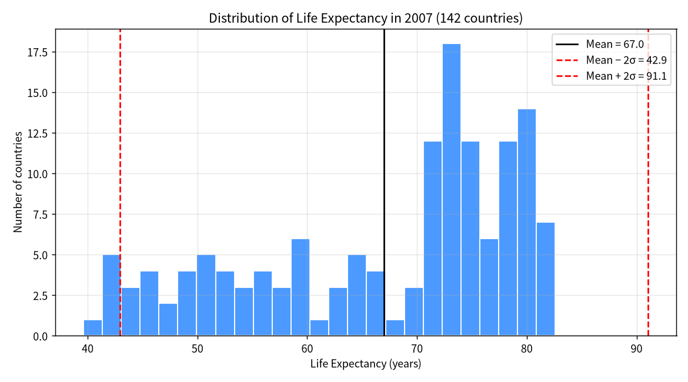
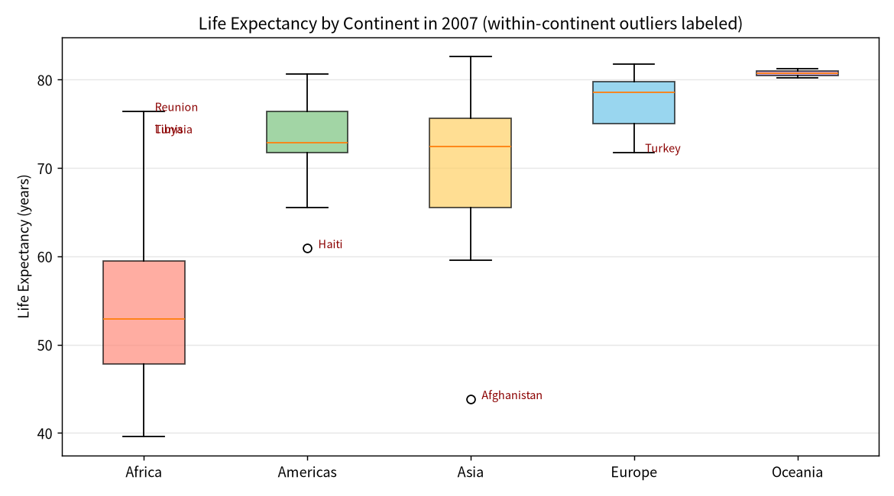
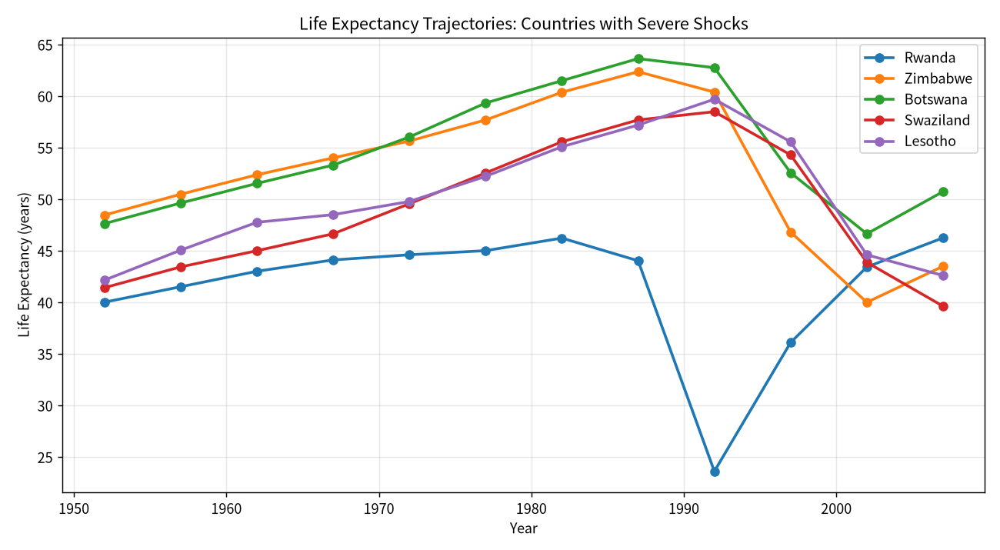
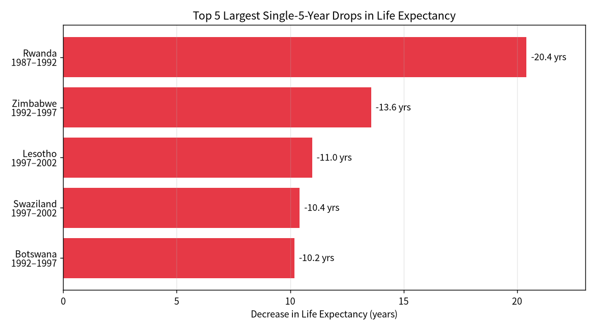

# Outliers & Anomalies in Gapminder Life Expectancy (1952–2007)

**Dataset:** `gapminder_life_expectancy.csv` — 142 countries, 5 continents, 12 five-year snapshots (1952–2007), 1,704 rows.
**Columns used:** `country`, `year`, `continent`, `lifeExp`.

---

## 1. Statistical Outlier Detection — 2007 (Global)

Two standard methods were applied to the 2007 cross-section (n = 142):

- **IQR (Tukey) rule:** outliers fall below Q1 − 1.5·IQR or above Q3 + 1.5·IQR.
- **Z-score rule:** observations with |z| > 2 (≈ 2.5% tails of a normal distribution) are flagged.

### Global 2007 summary statistics

| Statistic | Value |
|---|---|
| Mean life expectancy | 67.01 years |
| Std. deviation (population) | 12.03 years |
| Q1 | 57.16 |
| Median | 71.94 |
| Q3 | 76.41 |
| IQR | 19.25 |
| IQR lower fence (Q1 − 1.5·IQR) | **28.28** |
| IQR upper fence (Q3 + 1.5·IQR) | **105.29** |

### Results

- **IQR method:** No global outliers. The lowest value (Swaziland, 39.6) sits above the lower fence of 28.3, and the highest value (Japan, 82.6) sits far below the upper fence of 105.3. The worldwide distribution has heavy low-end tails but not heavy enough to be flagged by Tukey fences.
- **Z-score method (|z| > 2):** Only **low-end** outliers were found — six sub-Saharan African countries whose life expectancy is more than two standard deviations below the world mean:

| Country | Continent | Life Exp. 2007 | z-score |
|---|---|---:|---:|
| Swaziland (Eswatini) | Africa | 39.61 | −2.28 |
| Mozambique | Africa | 42.08 | −2.07 |
| Zambia | Africa | 42.38 | −2.05 |
| Sierra Leone | Africa | 42.57 | −2.03 |
| Lesotho | Africa | 42.59 | −2.03 |
| Angola | Africa | 42.73 | −2.02 |

**No high-end z-outliers** in 2007: Japan (82.6), Hong Kong (82.2) and Australia (81.2) all fall within +1.3 σ, consistent with the global distribution being left-skewed (a long tail of very-low-life-expectancy countries but no symmetric high-end tail).

---

## 2. Within-Continent Outliers (2007)

Because continents have very different baseline life expectancies, a more informative cut is to compare each country against its **own continent's** mean. For each continent we computed μ_c and σ_c and flagged countries with |z_within| > 2.

### Continent baselines (2007)

| Continent | Countries | Mean life exp. | Std. dev. |
|---|---:|---:|---:|
| Africa | 52 | 54.81 | 9.63 |
| Americas | 25 | 73.61 | 4.44 |
| Asia | 33 | 70.73 | 7.96 |
| Europe | 30 | 77.65 | 2.98 |
| Oceania | 2 | 80.72 | 0.73 |

### Countries deviating more than 2 σ from their continent mean

| Country | Continent | Life Exp. | Continent Mean | z_within | Difference |
|---|---|---:|---:|---:|---:|
| **Afghanistan** | Asia | 43.83 | 70.73 | **−3.43** | −26.90 |
| **Haiti** | Americas | 60.92 | 73.61 | **−2.92** | −12.69 |
| **Turkey** | Europe | 71.78 | 77.65 | −2.00 | −5.87 |
| **Reunion** | Africa | 76.44 | 54.81 | **+2.27** | +21.64 |
| **Libya** | Africa | 73.95 | 54.81 | +2.01 | +19.15 |
| **Tunisia** | Africa | 73.92 | 54.81 | +2.00 | +19.12 |

Notable observations:

- **Afghanistan** is the most extreme within-continent outlier in the entire dataset — almost 27 years below the Asian average, reflecting decades of war.
- **Haiti** is the clear laggard in the Americas, more than 12 years below its continental mean.
- On the positive side, **Reunion, Libya, and Tunisia** are North African / Indian-ocean-African countries whose life expectancies are more than 19 years above the African mean, closer to European/American levels.
- Europe and Oceania are so homogeneous (σ ≈ 3.0 and 0.7) that no country reaches +2 σ, but **Turkey** sits just at the −2 σ threshold on the European low end.

---

## 3. Temporal Anomalies — Life Expectancy Declines

Globally, life expectancy rose almost monotonically from 1952 to 2007. A 5-year period in which life expectancy **fell** is therefore a strong anomaly.

After sorting by country and year and differencing with the previous observation, **102 country-period pairs** show a decline of any magnitude. Most are small (≤ 1 year, likely measurement noise or mild short-term shocks), but many double-digit declines correspond to well-known humanitarian catastrophes.

### Counts: countries with repeated declines

| Country | # of 5-year periods with a decline |
|---|---:|
| Congo, Dem. Rep. | 4 |
| Zambia | 4 |
| Uganda | 4 |
| Botswana | 3 |
| Lesotho | 3 |
| Zimbabwe | 3 |
| Swaziland | 3 |
| South Africa | 3 |
| Kenya | 3 |
| Cameroon | 3 |
| Cote d'Ivoire | 3 |
| Gabon | 3 |
| Iraq | 3 |
| Korea, Dem. Rep. | 3 |
| Bulgaria | 3 |

The list is dominated by **sub-Saharan African countries** hit repeatedly by the HIV/AIDS pandemic, plus a handful of countries affected by war and political collapse (Iraq, DPRK) or post-communist transition (Bulgaria).

---

## 4. Top 5 Most Dramatic Single-Period Drops

The following are the five largest 5-year life-expectancy declines observed anywhere in the dataset.

| Rank | Country | Continent | Period | Life Exp. start | Life Exp. end | **Drop (years)** | Likely driver |
|---:|---|---|---|---:|---:|---:|---|
| 1 | **Rwanda** | Africa | 1987 → 1992 | 44.02 | 23.60 | **−20.42** | Rwandan Civil War (1990–1994) and the 1994 Genocide against the Tutsi. Mortality collapsed most sharply between 1990 and 1994, captured here as the 1987→1992 interval. |
| 2 | **Zimbabwe** | Africa | 1992 → 1997 | 60.38 | 46.81 | **−13.57** | Onset of the HIV/AIDS crisis combined with early economic collapse under Mugabe. |
| 3 | **Lesotho** | Africa | 1997 → 2002 | 55.56 | 44.59 | **−10.97** | Peak of the HIV/AIDS epidemic in southern Africa (Lesotho has one of the world's highest HIV prevalence rates, >20% of adults). |
| 4 | **Swaziland (Eswatini)** | Africa | 1997 → 2002 | 54.29 | 43.87 | **−10.42** | Same HIV/AIDS peak; Swaziland records the world's highest HIV prevalence (~27% adults at peak). |
| 5 | **Botswana** | Africa | 1992 → 1997 | 62.75 | 52.56 | **−10.19** | HIV/AIDS mortality surge — Botswana was one of the hardest-hit countries before the 2002 rollout of antiretroviral therapy. |

### Other notable large drops (>5 years) worth flagging

| Country | Period | Drop | Driver |
|---|---|---:|---|
| Cambodia | 1972 → 1977 | −9.10 | Khmer Rouge genocide (1975–1979), 1.7–2.5 million killed. |
| Namibia | 1997 → 2002 | −7.43 | HIV/AIDS. |
| South Africa | 1997 → 2002 | −6.87 | HIV/AIDS peak under Mbeki's AIDS-denialist policies. |
| Zimbabwe | 1997 → 2002 | −6.82 | Continued HIV/AIDS + economic meltdown. |
| China | 1957 → 1962 | −6.05 | **Great Leap Forward famine (1959–1961)** — the largest man-made famine in history, 15–45 million excess deaths. |
| Botswana | 1997 → 2002 | −5.92 | Ongoing HIV/AIDS. |
| Zambia | 1992 → 1997 | −5.86 | HIV/AIDS and economic decline. |
| Iraq | 1987 → 1992 | −5.58 | Gulf War (1991) and sanctions. |
| Liberia | 1987 → 1992 | −5.23 | First Liberian Civil War. |
| Cambodia | 1967 → 1972 | −5.10 | US bombing campaign and civil war prelude to Khmer Rouge. |
| Kenya | 1992 → 1997 | −4.88 | HIV/AIDS. |
| Somalia | 1987 → 1992 | −4.84 | Somali Civil War / state collapse. |

---

## 5. Analysis — What's Driving These Outliers?

The outliers and anomalies cluster tightly around three recurring drivers, each with a clear historical and geographic signature.

### (a) HIV/AIDS — the dominant signal of 1990–2005

Virtually every large decline in southern Africa between **1990 and 2005** corresponds to the HIV/AIDS pandemic. Adult HIV prevalence in Botswana, Lesotho, Swaziland, South Africa, Zimbabwe, Namibia, Zambia, and parts of Mozambique exceeded 20% at the turn of the century. Untreated, HIV nearly doubled adult mortality and drove life expectancy down by 10–15 years within a single decade in several of these countries. This explains:

- Five of the top six global single-period drops,
- The "U-shape" trajectories of Botswana, Zimbabwe, Swaziland, and Lesotho visible in the trajectories chart,
- The 2007 low-end global outliers (Swaziland, Mozambique, Zambia, Lesotho, Angola are all high-prevalence southern/eastern African countries),
- The high count of repeat-decline countries (3–4 declines each) — HIV mortality accumulates across multiple 5-year windows as prevalence rises.

The beginnings of recovery after 2002 (visible in Botswana and partially Uganda) correspond to the rollout of antiretroviral therapy (ART), and in Uganda's case to earlier prevention campaigns.

### (b) War, genocide, and state collapse

Sharp, one-off declines in life expectancy are overwhelmingly tied to mass-violence events:

- **Rwanda 1987–1992 (−20.4 yrs):** the largest drop in the entire dataset, reflecting the Rwandan civil war and 1994 genocide. (Note that because the data is binned in 5-year snapshots centered on 1987, 1992, etc., the 1994 genocide falls in the 1992→1997 interval, but the steepest decline actually begins in the lead-up war of 1990–1993 and is partially captured here; the 1987→1992 drop of 20 years is partly a data artifact of the early war years, with the genocide's full impact also spilling into the 1992→1997 window.)
- **Cambodia 1967–1977:** two consecutive large declines (−5.1 and −9.1 yrs) matching the US bombing campaign, civil war, and the Khmer Rouge regime that killed ~25% of the population.
- **Liberia 1987–1992 (−5.2 yrs):** outbreak of the First Liberian Civil War.
- **Somalia 1987–1992 (−4.8 yrs):** collapse of Siad Barre's regime and civil war.
- **Iraq 1987–2002:** declines of −5.6 (1987→1992, Gulf War), −0.7 (1992→1997), and −1.8 (1997→2002, sanctions era).
- **Afghanistan 2007 within-continent outlier (−27 years vs. Asian mean):** cumulative effect of the Soviet war, 1990s civil war, and Taliban conflict.
- **Haiti** as the Americas outlier: a long history of political instability, poverty, and weak health systems rather than a single acute war.

### (c) Famine and political-economic catastrophe

- **China 1957–1962 (−6.0 yrs):** the Great Leap Forward produced the largest famine of the 20th century (1959–1961).
- **North Korea (1992–2002):** three consecutive small declines (−2.3, −1.1, −1.1) consistent with the Arduous March famine of the mid-1990s.
- **Zimbabwe 1997–2007:** compound effect of HIV/AIDS and economic collapse (hyperinflation, land reform) — Zimbabwe is the only country in the dataset with a near-monotonic decline for 15 years.

### (d) Transition-economy dips (small but systematic)

Several Eastern European countries show small (<1 year) declines in the early 1990s — **Bulgaria** (3 declines, 1972–1997), **Romania**, **Poland**, **Hungary**, **Albania**, **Slovakia**, **Serbia/Montenegro** — reflecting the post-Soviet mortality crisis, where life expectancy dipped briefly (especially among working-age men) before recovering. These are not outliers in magnitude but are notable as a non-conflict, non-disease mechanism.

---

## 6. Summary

- **Outliers are overwhelmingly low-end, African, and post-1990.** The 2007 z-outliers are all southern-African countries devastated by HIV/AIDS; no country is an outlier on the high end.
- **Within continents, the story is conflict + disease.** Afghanistan (war), Haiti (fragile state), and Reunion/Libya/Tunisia (healthy African outliers) stand out; Europe and Oceania are tightly clustered.
- **The five biggest single-period shocks in life expectancy since 1952 are the Rwandan genocide (1994), the HIV/AIDS surge in Zimbabwe, Lesotho, Swaziland, and Botswana (1990s–early 2000s).**
- **Repeated declines are a signature of either long-running epidemic (HIV) or long-running conflict/state failure (DRC, Iraq, North Korea).**
- The historical record (genocide, war, famine, epidemic, economic collapse) lines up almost perfectly with every statistical anomaly flagged by z-scores, IQR, and period-over-period differencing — giving strong external validation to the outlier detection.
