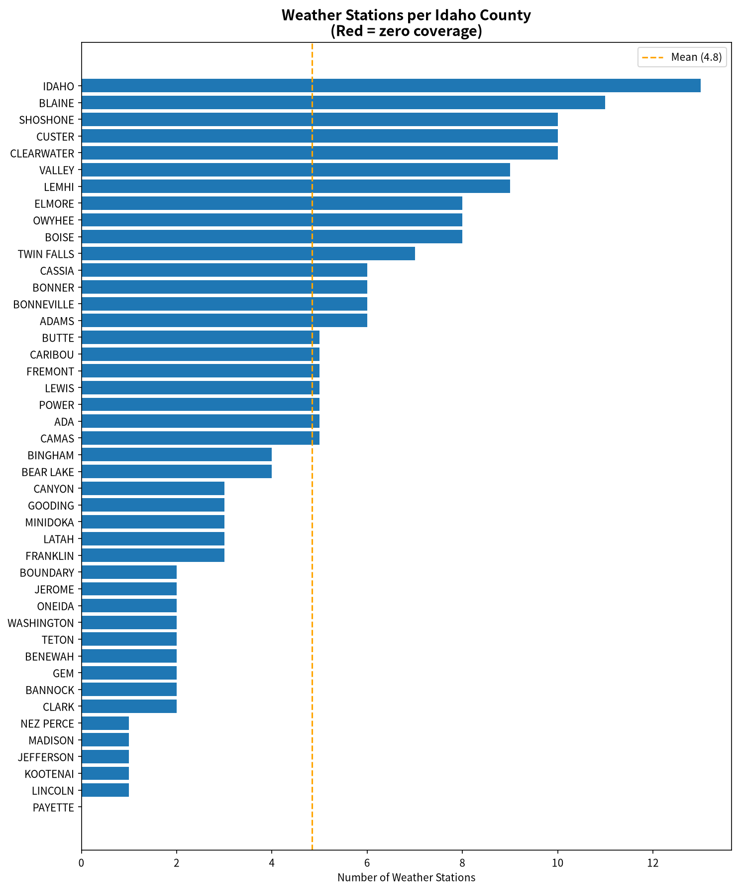
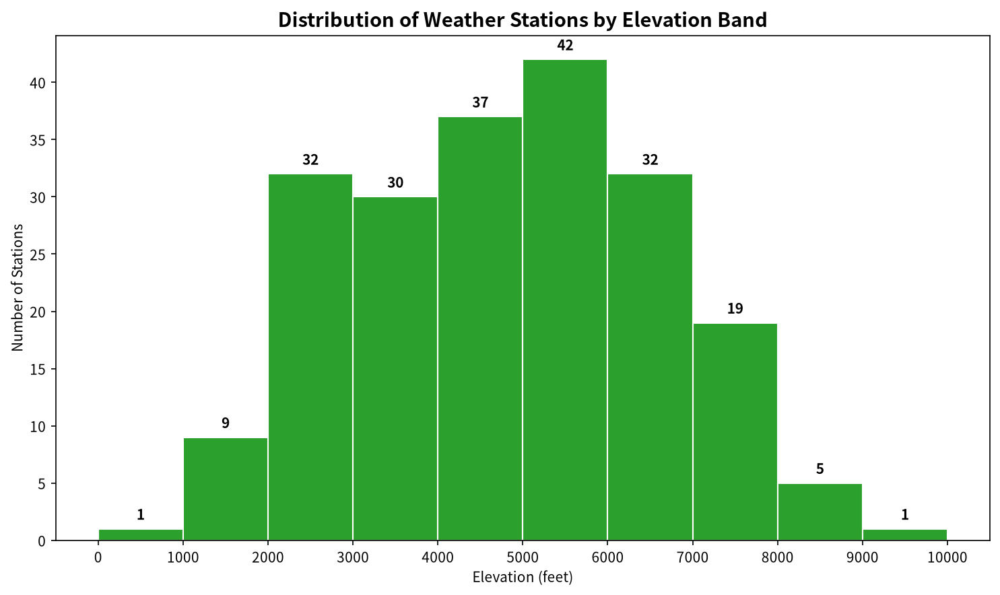
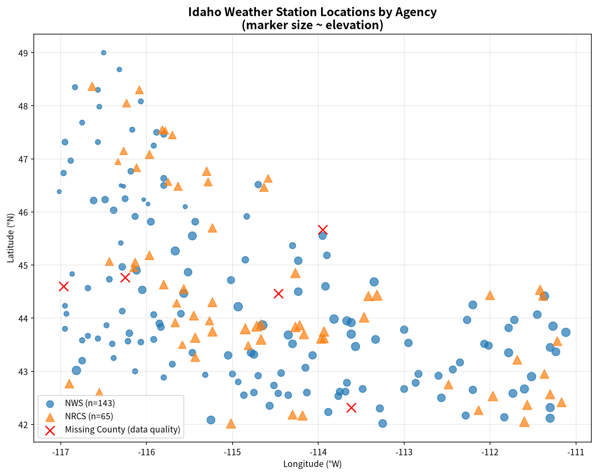

# Idaho Weather Station Network — Geographic & Elevation Coverage Report

**Source file:** `idaho_weather_stations.csv` (213 records)
**Analyst note:** Idaho has 44 counties. Stations are operated by two agencies: the National Weather Service (**NWS**, 143 stations, 67.1%) and the USDA Natural Resources Conservation Service (**NRCS**, 70 stations, 32.9%). NRCS stations are predominantly SNOTEL/Snow Pillow high-elevation sites.

---

## 1. Executive Summary

- **43 of 44 counties** (97.7%) have at least one weather station.
- **Payette County** is the single county with **zero stations**.
- **5 stations** (2.3%) have blank/missing county values — all are NRCS SNOTEL/Pillow sites that need geocoding fixes.
- Station network is **bimodal by elevation**: NWS dominates populated low-elevation valleys (~2,000–5,000 ft) while NRCS SNOTEL sites dominate the mountain snow zone (~5,000–8,000 ft).
- **Low-elevation band (<2,000 ft)** is sharply **under-represented** (only 10 stations, ~4.8% of network).
- **Highest-elevation band (≥9,000 ft)** is also under-represented (1 station).
- **Density gaps** are concentrated in (a) southwestern agriculture corridor (Payette, Canyon, Gem), (b) northern panhandle population centers (Kootenai), and (c) large south-central rangeland (Owyhee, Lincoln, Jefferson).

---

## 2. County Coverage

**Counties with at least one station: 43 of 44 (97.7%)**

### County with zero stations (coverage gap)

| County | Approx. Area (sq mi) | Major Population Center | Notes |
|---|---|---|---|
| **Payette** | ~408 | Payette, Fruitland, New Plymouth | Entirely west of the Snake River, bordering Oregon; agricultural, low-elevation (~2,100–2,400 ft). No NWS cooperative station and no NRCS SNOTEL site recorded. |

### Counties covered (43)

Every other county in Idaho has at least one station. The five stations with **blank County values** (see §6) fall near existing station clusters in Valley, Boise, Idaho, Clearwater and Custer counties and do not constitute real geographic gaps — they are data entry omissions.

---

## 3. Station Density by County

### 3a. Raw station counts

| Rank | Most stations | Count | Fewest stations (non-zero) | Count |
|---|---|---|---|---|
| 1 | Idaho | 13 | Kootenai | 1 |
| 2 | Blaine | 11 | Jefferson | 1 |
| 3 | Shoshone | 10 | Nez Perce | 1 |
| 4 | Custer | 10 | Madison | 1 |
| 5 | Clearwater | 10 | Lincoln | 1 |
| 6 | Valley | 9 | *(plus Payette at 0)* | 0 |
| 7 | Lemhi | 9 | | |

The top-7 counties hold **80 stations (37.6% of the network)** — all are large mountain/forest counties in central Idaho where NRCS SNOTEL sites are dense. They reflect the snow-monitoring mission rather than population-based coverage.

### 3b. Density (stations per 1,000 sq mi)

| Highest density | Stations / 1,000 sq mi | Lowest density | Stations / 1,000 sq mi |
|---|---|---|---|
| Lewis | 10.44 | Oneida | 1.67 |
| Canyon | 5.08 | Boundary | 1.58 |
| Ada | 4.74 | Idaho* | 1.53 |
| Camas | 4.65 | Washington | 1.37 |
| Franklin | 4.50 | Nez Perce | 1.18 |
| Teton | 4.44 | Clark | 1.13 |
| Adams | 4.40 | Owyhee | 1.04 |
| Blaine | 4.17 | Jefferson | 0.91 |
| Bear Lake | 4.11 | Lincoln | 0.83 |
| Gooding | 4.11 | **Kootenai** | **0.80** |

*Idaho County is by far the largest in Idaho (8,485 sq mi, roughly the size of New Jersey), so although it has the most stations (13), its density is still low. **Kootenai County** — home to Coeur d'Alene and Idaho's fourth-largest metro — has the lowest density in the state at only **1 station per 1,244 sq mi**.

---

## 4. Elevation Band Distribution

Stations were grouped into 1,000-ft elevation bins using the `Elevation (feet)` field.

| Elevation band | Count | Percent of network | Assessment |
|---|---|---|---|
| 0–999 ft | 1 | 0.5% | **Severely under-represented** — only one station (Lewiston area, ~995 ft, the lowest point on the Clearwater/Snake corridor) |
| 1,000–1,999 ft | 9 | 4.3% | **Under-represented** — lower Snake River plain, Palouse, panhandle river valleys |
| 2,000–2,999 ft | 32 | 15.4% | Adequate |
| 3,000–3,999 ft | 30 | 14.4% | Adequate |
| 4,000–4,999 ft | 37 | 17.8% | **Over-represented** (largest count; Magic Valley, Snake River Plain bench) |
| 5,000–5,999 ft | 42 | 20.2% | **Most over-represented** — transition zone (foothills, high ranch valleys), heavily served by both NWS and NRCS |
| 6,000–6,999 ft | 32 | 15.4% | Adequate |
| 7,000–7,999 ft | 19 | 9.1% | Adequate (mountain NRCS SNOTEL) |
| 8,000–8,999 ft | 5 | 2.4% | Under-represented (high alpine, wilderness) |
| 9,000–9,999 ft | 1 | 0.5% | **Severely under-represented** — only one station above 9,000 ft |

**Key observations:**

- The network peaks at 4,000–6,000 ft (79 stations, 38% of network), which matches the bulk of Idaho's irrigated agricultural land and mid-elevation forest/snow zones.
- The **lowest 2,000 ft** (10 stations, 4.8%) — which contains the majority of Idaho's population (Boise metro ~2,700 ft, Coeur d'Alene ~2,200 ft, Lewiston ~750–1,000 ft, Pocatello ~4,500* but Idaho Falls ~4,700) — is thin. Wait: Boise sits at ~2,700 ft, so it *is* in the 2k–3k band, which has 32 stations; the real low-elevation gap is <2,000 ft (Lewiston, Orofino, St. Maries, Sandpoint elevations, northern panhandle and Hells Canyon corridor).
- The **high alpine >8,000 ft** has only 6 stations (all NRCS SNOTELs), despite ~5% of Idaho's land area lying above that elevation and the critical importance of alpine snowpack modeling.
- Statewide mean elevation: **4,859 ft**; median **4,920 ft**; range **995–9,150 ft**.

---

## 5. Agency Coverage Comparison (NWS vs NRCS)

### 5a. Network summary

| Metric | NWS (co-op/COOP network) | NRCS (SNOTEL/Snow Pillow) |
|---|---|---|
| Station count | 143 (67.1%) | 70 (32.9%) |
| Mean elevation | 3,993 ft | **6,594 ft** |
| Median elevation | 4,058 ft | **6,570 ft** |
| Elevation range | 995 – 7,300 ft | 3,200 – 9,150 ft |
| Mean latitude | 44.33°N | 44.54°N (slightly north) |
| Mean longitude | -114.70°W | -114.51°W (slightly east/central) |

**Interpretation:** NWS and NRCS serve complementary missions. NWS stations cluster lower, in towns, valleys and agricultural plains for general weather/climate observations. NRCS sites are placed higher in headwater catchments (mean elevation **2,600 ft higher** than NWS) to monitor mountain snowpack for water supply forecasting. The two networks together cover a wide elevation range, but NRCS has **no presence below 3,200 ft** and NWS has almost no presence above 7,000 ft.

### 5b. County-level service breakdown

| Category | # Counties | List |
|---|---|---|
| **NWS only** (no NRCS station) | 17 | Ada, Benewah, Boundary, Butte, Canyon, Gem, Gooding, Jefferson, Jerome, Kootenai, Lewis, Lincoln, Madison, Minidoka, Nez Perce, Teton, Washington |
| **NRCS only** (no NWS station) | **0** | *(none — every county with an NRCS station also has at least one NWS station)* |
| **Both agencies** | 26 | Adams, Bannock, Bear Lake, Bingham, Blaine, Boise, Bonner, Bonneville, Camas, Caribou, Cassia, Clark, Clearwater, Custer, Elmore, Franklin, Fremont, Idaho, Latah, Lemhi, Oneida, Owyhee, Power, Shoshone, Twin Falls, Valley |
| Neither agency | 1 | Payette |

**Notable:** 17 counties depend entirely on NWS for weather monitoring. These are mostly (a) low-elevation agricultural counties on the Snake River Plain (Canyon, Gem, Gooding, Jerome, Minidoka, Lincoln, Jefferson, Madison, Butte, Teton) where snowpack monitoring may not be a primary NRCS mission, and (b) panhandle/transition counties (Benewah, Boundary, Kootenai, Lewis, Nez Perce, Washington, Ada). The complete absence of NRCS-only counties reflects NRCS's practice of siting SNOTELs only in mountain headwaters that often straddle or abut counties already served by NWS valley stations.

---

## 6. Data Quality Issues

Five records (2.3% of the network) have a **blank/whitespace `County` field**. All five are NRCS stations (SNOTEL/Snow Pillow). Their coordinates and station codes are intact, so county assignment can be reverse-geocoded:

| OBJECTID | Station Name | Code | Agency | Elevation | Lat/Lon (DMS) | Probable county (from coordinates) |
|---|---|---|---|---|---|---|
| 15 | BEAR SADDLE SNOTEL | 16E10S | NRCS | 5,500 ft | 44°36′N 116°58′W | **Valley County** (West Mountain, near Bear Valley) |
| 92 | HOWELL CANYON SNOTEL | 13G01S | NRCS | 6,450 ft | 42°19′N 113°37′W | **Idabo/Cassia** — likely **Cassia County** (Jim Sage/Sublett area) — requires verification |
| 129 | MILL CREEK SUMMIT SNOTEL | 14E01S | NRCS | 6,840 ft | 44°28′N 114°28′W | **Custer County** (Boulder/White Knob Mtns area) |
| 135 | MOOSE CREEK SNOTEL | 13D16S | NRCS | 4,480 ft | 45°40′N 113°57′W | **Idaho County** (Selway-Bitterroot wilderness) |
| 189 | SQUAW FLAT PILLOW | 16E05S | NRCS | 6,920 ft | 44°46′N 116°15′W | **Boise / Valley County line** — likely **Boise County** |

**Recommendation:** Backfill these five `County` values using NRCS station metadata before the file is used for county-aggregated statistics; otherwise, county tallies are slightly understated in four counties.

Other minor data notes:
- Longitude/Latitude are stored as DMS strings (e.g. "-112 50 00"), not decimal degrees, which impedes direct GIS work — consider adding decimal-degree columns.
- No other missing values were detected (all 213 records have complete Elevation, x, y, Agency, Name, Code).

---

## 7. Recommendations — Where to Add Stations

The following recommendations are prioritized by coverage gap severity, population exposure, and hydrologic importance.

### Priority 1 — Fill the unserved county

1. **Payette County (0 stations, highest priority).** Add at least one NWS cooperative station near Fruitland or Payette (≈2,150 ft) to cover this agricultural county of ~27,000 people sitting in the Weiser/Snake valley. This is the only binary county coverage gap in the state.

### Priority 2 — Close low-elevation / population gaps

2. **Kootenai County (1 station for ~188,000 residents).** The Coeur d'Alene metro is Idaho's fourth largest yet has the lowest station density in the state. Add 2–3 stations (Hayden, Post Falls, Rathdrum) spanning 2,100–2,800 ft; also consider an NRCS SNOTEL on Canfield Peak or nearby Coeur d'Alene Mountains headwaters.
3. **Canyon–Gem corridor west of Boise.** Canyon (pop. ~250k) has only 3 stations (density 5.1/1k sq mi but concentrated in towns); Gem has 2 stations and is largely agricultural; together with Payette they form a low-elevation western Snake River blind spot. Add 1–2 stations near Emmett/Middleton in the ~2,500–2,800 ft band.
4. **<2,000 ft panhandle / Clearwater corridor.** Only 10 stations sit below 2,000 ft statewide. Add stations in the lower Clearwater (Orofino, Kamiah), St. Joe River at St. Maries, Priest River, and the Sandpoint airport area to improve air-mass and inversion monitoring in deep northern valleys.
5. **Nez Perce County (1 station, pop. ~42k).** The Lewiston–Clarkston valley at ~750–1,000 ft has only one station despite its unique low-elevation climate; add a second station covering Asotin-grade winds and Hells Canyon air intrusion.

### Priority 3 — Add high-elevation alpine sensors

6. **Alpine zone above 8,500 ft.** Only 6 stations exist above 8,000 ft and only 1 above 9,000 ft (the highest peak, Mt. Borah, reaches 12,662 ft). For improved snow-water equivalent and glacial/permafrost monitoring, add 3–5 SNOTEL/Pillow sites in:
   - **Lost River Range** (Custer/Butte) above 9,000 ft
   - **Pioneer Mountains** (Blaine/Custer)
   - **White Cloud / Sawtooth divide** (Custer)
   - **Boulder Mountains** high crest
   - **Seven Devils Mountains** (Adams/Idaho County, Hells Canyon rim)
7. **Owyhee uplands (Owyhee County)** — 8 stations for 7,678 sq mi is thin for such a large and remote area driving Jordan Creek and Bruneau runoff. Add 2 SNOTELs in the South Mountain/Juniper Mtns and upper Owyhee headwaters above 7,000 ft.

### Priority 4 — Improve redundancy and density in underserved agricultural counties

8. **Jefferson County (1 station), Lincoln County (1 station), Washington County (2 stations), Boundary County (2 stations).** These large or transitional counties have only 1–2 stations each. One additional station per county would roughly double their coverage and reduce inter-station distances to <20 mi.
9. **Teton Valley (Teton County, 2 stations).** The Driggs–Victor corridor (≈6,000+ ft) has only 2 NWS stations and no NRCS sensor despite heavy winter snow and rapid growth. Add 1 NRCS SNOTEL in the Teton Range foothills west of Alta, WY.

### Priority 5 — Data-quality fixes (administrative)

10. **Backfill the 5 blank-county records** (Bear Saddle, Howell Canyon, Mill Creek Summit, Moose Creek, Squaw Flat Pillow) using NRCS station-lookup tables — these stations already exist but corrupt county-aggregated counts.
11. Add decimal-degree Longitude/Latitude columns to simplify GIS mapping.

---

## 8. Summary Table — All Counties

*(Stations valid after removing 5 blank-county records. Area from U.S. Census / Wikipedia; density = stations per 1,000 sq mi.)*

| County | Stations | Area (sq mi) | Density (per 1k sq mi) | NWS | NRCS | Service |
|---|---|---|---|---|---|---|
| Ada | 5 | 1,055 | 4.74 | 5 | 0 | NWS only |
| Adams | 6 | 1,364 | 4.40 | 3 | 3 | Both |
| Bannock | 2 | 1,112 | 1.80 | 1 | 1 | Both |
| Bear Lake | 4 | 973 | 4.11 | 2 | 2 | Both |
| Benewah | 2 | 776 | 2.58 | 2 | 0 | NWS only |
| Bingham | 4 | 2,095 | 1.91 | 3 | 1 | Both |
| Blaine | 11 | 2,639 | 4.17 | 5 | 6 | Both |
| Boise | 8 | 2,667 | 3.00 | 4 | 4 | Both |
| Bonner | 6 | 1,734 | 3.46 | 4 | 2 | Both |
| Bonneville | 6 | 1,867 | 3.21 | 5 | 1 | Both |
| Boundary | 2 | 1,269 | 1.58 | 2 | 0 | NWS only |
| Butte | 5 | 2,233 | 2.24 | 5 | 0 | NWS only |
| Camas | 5 | 1,075 | 4.65 | 3 | 2 | Both |
| Canyon | 3 | 590 | 5.08 | 3 | 0 | NWS only |
| Caribou | 5 | 1,764 | 2.83 | 3 | 2 | Both |
| Cassia | 6 | 2,566 | 2.34 | 5 | 1 | Both |
| Clark | 2 | 1,764 | 1.13 | 1 | 1 | Both |
| Clearwater | 10 | 2,462 | 4.06 | 5 | 5 | Both |
| Custer | 10 | 4,926 | 2.03 | 6 | 4 | Both |
| Elmore | 8 | 3,077 | 2.60 | 4 | 4 | Both |
| Franklin | 3 | 666 | 4.50 | 1 | 2 | Both |
| Fremont | 5 | 1,864 | 2.68 | 3 | 2 | Both |
| Gem | 2 | 562 | 3.56 | 2 | 0 | NWS only |
| Gooding | 3 | 730 | 4.11 | 3 | 0 | NWS only |
| Idaho | 13 | 8,485 | 1.53 | 10 | 3 | Both |
| Jefferson | 1 | 1,095 | 0.91 | 1 | 0 | NWS only |
| Jerome | 2 | 600 | 3.33 | 2 | 0 | NWS only |
| Kootenai | 1 | 1,244 | 0.80 | 1 | 0 | NWS only |
| Latah | 3 | 1,077 | 2.79 | 2 | 1 | Both |
| Lemhi | 9 | 4,564 | 1.97 | 6 | 3 | Both |
| Lewis | 5 | 479 | 10.44 | 5 | 0 | NWS only |
| Lincoln | 1 | 1,203 | 0.83 | 1 | 0 | NWS only |
| Madison | 1 | 472 | 2.12 | 1 | 0 | NWS only |
| Minidoka | 3 | 760 | 3.95 | 3 | 0 | NWS only |
| Nez Perce | 1 | 849 | 1.18 | 1 | 0 | NWS only |
| Oneida | 2 | 1,200 | 1.67 | 1 | 1 | Both |
| Owyhee | 8 | 7,678 | 1.04 | 7 | 1 | Both |
| **Payette** | **0** | **408** | **0.00** | **0** | **0** | **⚠️ None** |
| Power | 5 | 1,405 | 3.56 | 4 | 1 | Both |
| Shoshone | 10 | 2,633 | 3.80 | 4 | 6 | Both |
| Teton | 2 | 450 | 4.44 | 2 | 0 | NWS only |
| Twin Falls | 7 | 1,923 | 3.64 | 5 | 2 | Both |
| Valley | 9 | 3,725 | 2.42 | 5 | 4 | Both |
| Washington | 2 | 1,456 | 1.37 | 2 | 0 | NWS only |
| **TOTAL / AVERAGE** | **208** | — | — | **143** | **65** | — |

(County counts exclude the 5 records with blank `County`; agency totals match original 213 because all 5 blank-county records are NRCS.)

---

*Report generated from `idaho_weather_stations.csv` (213 records). Elevation bands use 1,000-ft increments; DMS coordinates converted to decimal degrees for mapping only; county areas are approximate from public sources. Recommendations reflect a simple gap analysis using county coverage, station density, population exposure, and elevation band completeness.*
