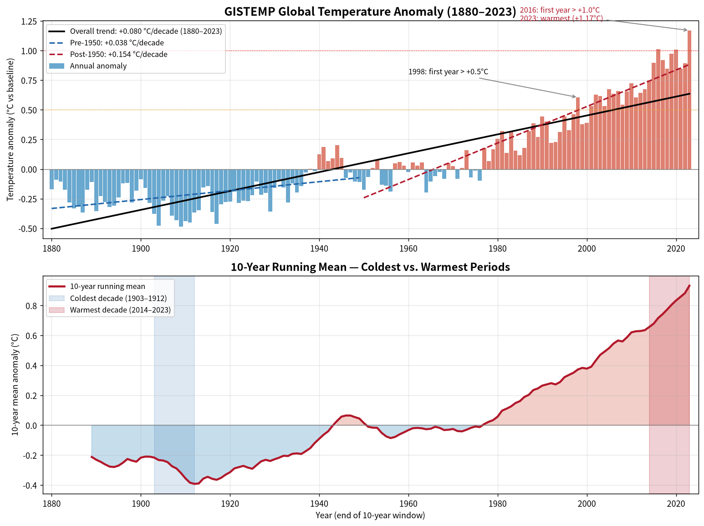

# Global Temperature Trend Analysis (GISTEMP, 1880–2023)

**Data source:** `global_temperature.csv`, filtered to the `GISTEMP` source (NASA GISS Surface Temperature Analysis).
**Period analyzed:** 1880 – 2023 (144 annual averages derived from monthly records).
**Units:** Temperature anomaly in °C relative to the GISTEMP baseline period.

---

## 1. Overall Trend (1880–2023)

Annual mean anomalies were computed from monthly GISTEMP records, then a simple ordinary-least-squares linear regression was fit against year.

| Metric | Value |
|---|---|
| Linear trend (slope) | **+0.0797 °C per decade** |
| Coefficient of determination (R²) | 0.767 |
| Implied total warming over 1880–2023 (143 years) | ≈ **+1.14 °C** |
| Coldest single year | 1909 (−0.49 °C) |
| Warmest single year | 2023 (+1.17 °C) |

Over the full 144-year instrumental record, the planet has warmed by a little over 1 °C relative to the late-19th-century baseline, at an average pace of roughly **0.08 °C per decade**. The R² of 0.77 indicates that the linear trend explains the large majority of year-to-year variance — a very strong secular signal despite short-term noise from volcanoes (e.g., Pinatubo, 1991–92) and El Niño/La Niña cycles.

---

## 2. Acceleration Analysis (Pre- vs Post-1950)

To test whether warming has accelerated, the record was split at 1950 and a separate linear trend was fit to each half:

| Period | Years | Trend (°C/decade) | R² |
|---|---|---|---|
| Pre-1950 | 1880–1949 (70 yrs) | **+0.038** | 0.241 |
| Post-1950 | 1950–2023 (74 yrs) | **+0.154** | 0.883 |
| **Acceleration ratio** | — | **≈ 4.1 × faster post-1950** | — |

**Interpretation:**
- The early period shows weak, somewhat noisy warming (~0.04 °C/decade) with low R², reflecting early 20th-century warming partially offset by mid-century aerosol cooling.
- The post-1950 period exhibits a steep, highly significant warming rate of ~0.15 °C/decade — roughly **four times faster** than the pre-1950 rate — consistent with the dominant and growing influence of anthropogenic greenhouse-gas forcing.
- The post-1950 R² of 0.88 is remarkably high for a climate time series, indicating that recent warming is essentially a monotonic, near-linear rise once multidecadal internal variability is averaged out.

---

## 3. Coldest and Warmest 10-Year Stretches

A 10-year trailing moving average was computed over the annual anomaly series to identify the coldest and warmest decades in the record:

| Rank | 10-year window | Mean anomaly (°C) |
|---|---|---|
| **Coldest** | **1903 – 1912** | **−0.39** |
| **Warmest** | **2014 – 2023** | **+0.93** |

The coldest decade falls in the early 20th century, following the 1902–1904 cooling episodes and predating the main anthropogenic warming signal. The warmest decade is, unambiguously, the most recent ten years on record — every year from 2014 to 2023 ranks among the warmest ever observed, and the window closes with 2023 as the hottest single year in the entire series (+1.17 °C). The swing between the coldest and warmest 10-year means is **≈ 1.32 °C**.

---

## 4. Milestone Crossings

Scanning the annual series for the first exceedance of two symbolic thresholds:

| Threshold | First year exceeded | Annual anomaly (°C) |
|---|---|---|
| **+0.5 °C** | **1998** | +0.61 |
| **+1.0 °C** | **2016** | +1.01 |

- **+0.5 °C** was first crossed in the strong 1997–98 El Niño year, after which anomalies have nearly always stayed above ~+0.4 °C.
- **+1.0 °C** was first crossed in 2016 (another extreme El Niño), briefly dipped, and was then decisively surpassed in 2020 (+1.01 °C) and 2023 (+1.17 °C). Both milestones were reached within the last three decades, underscoring how rapidly the climate system has departed from its pre-industrial range.

---

## 5. Recent Warming Context (2014–2023 vs 1880–1889)

Directly comparing the first and last complete decades in the record:

| Decade | Mean anomaly (°C) |
|---|---|
| Earliest (1880–1889) | **−0.21** |
| Most recent (2014–2023) | **+0.93** |
| **Difference** | **+1.14 °C** |

The world of 2014–2023 is on average about **1.14 °C warmer** than the world of 1880–1889 — closely matching the linear trend's cumulative warming estimate. The earliest decade sat comfortably below the late-19th-century baseline, whereas the most recent decade sits nearly 1 °C *above* it, with no overlap between the two decades' annual distributions.

---

## 6. Summary

- **Long-term trend:** Over 1880–2023, GISTEMP data show a statistically robust warming of **~0.08 °C per decade**, totaling roughly **+1.14 °C** across the full record.
- **Clear acceleration:** Warming in the post-1950 era (**+0.15 °C/decade**) is approximately **4 × faster** than in the 1880–1949 period (+0.04 °C/decade), with the trend explaining 88% of post-1950 annual variance.
- **Record endpoints:** The coldest decade (1903–1912, −0.39 °C) and the warmest decade (2014–2023, +0.93 °C) bracket a ~1.3 °C swing; 2023 is the single warmest year (+1.17 °C) and 1909 the coldest (−0.49 °C).
- **Milestones reached recently:** The +0.5 °C threshold was first crossed in **1998**, and the +1.0 °C threshold in **2016** — both within the last ~25 years of the 144-year record.
- **Bookend contrast:** The most recent decade (2014–2023) is **1.14 °C warmer** than the first decade of the record (1880–1889), demonstrating that modern temperatures sit entirely outside the range experienced at the start of the instrumental era.

Taken together, the GISTEMP record paints a clear picture of a modest and variable early-20th-century climate giving way to a steep, sustained, and accelerating warming trend — a signature consistent with rapidly increasing greenhouse-gas concentrations over the industrial era.
