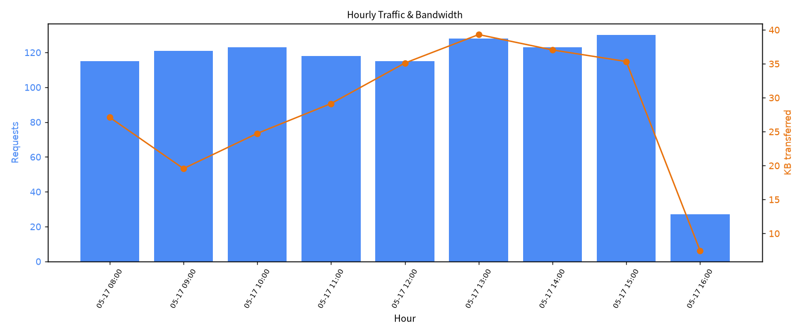
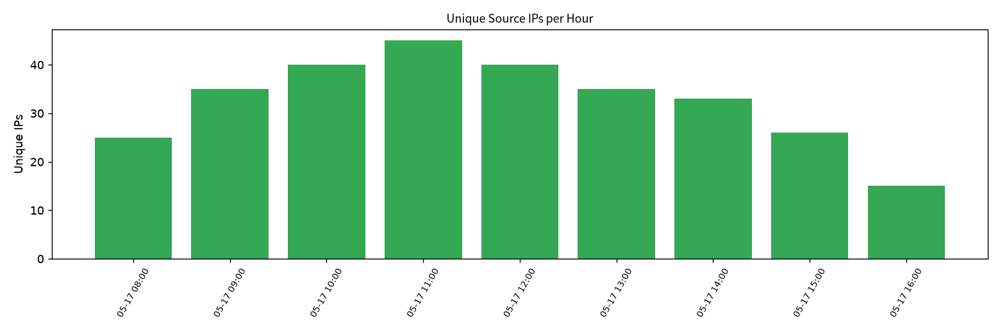
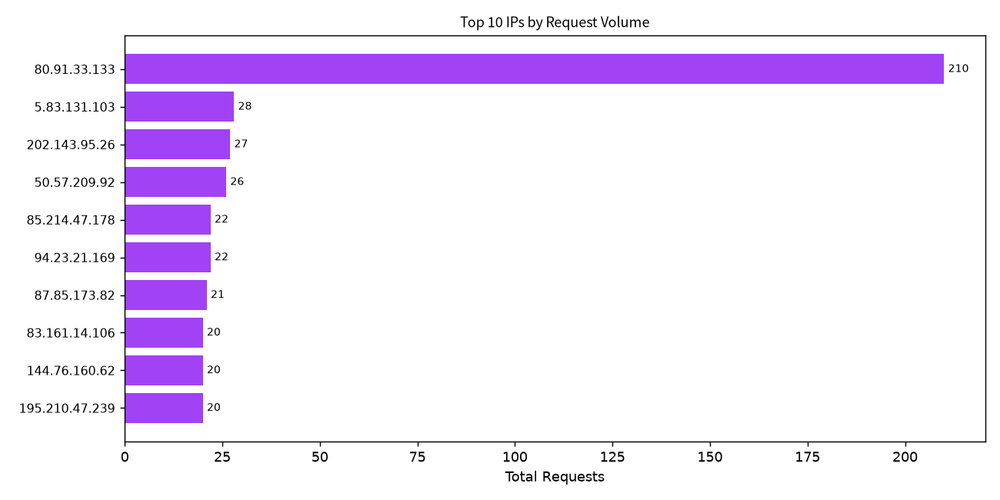

# Nginx Traffic Analysis Report

**Source log:** `nginx_access.log`
**Generated:** 2026-07-16

---

## 1. Executive Summary

| Metric | Value |
|---|---|
| Total requests | **1,000** |
| Time range | **2015-05-17 08:05:00 UTC → 2015-05-17 16:05:57 UTC** (~8 hours 1 minute) |
| Unique source IPs | **73** |
| Total bytes transferred | **260,963 bytes** (~0.25 MB) |
| Avg response size | ~261 bytes/request |
| Requests per hour (mean / median) | **111.1 / 121** |
| Peak hour | **15:00 UTC — 130 requests** |
| Quietest hour | **16:00 UTC — 27 requests** (partial hour, log cut-off) |

Traffic is dominated by automated `apt-http` clients pulling Debian packages from `/downloads/product_1` and `/downloads/product_2`. A single IP (`80.91.33.133`) accounts for **21% of all requests** and appears in **8 of 9 hours**, indicating a persistent/repeated polling client.

---

## 2. Time Range

The log covers a single day — **Sunday, 17 May 2015** — starting at **08:05:00 UTC** and ending at **16:05:57 UTC**. The 8-hour window spans morning through late afternoon UTC. The final hour (16:00) contains only partial data because the log ends at 16:05:57, which explains the sharp drop-off.

---

## 3. Hourly Traffic Breakdown

| Hour (UTC) | Requests | Unique IPs | Bytes (KB) |
|---|---:|---:|---:|
| 2015-05-17 08:00 | 115 | 25 | 27.11 |
| 2015-05-17 09:00 | 121 | 35 | 19.57 |
| 2015-05-17 10:00 | 123 | 40 | 24.75 |
| 2015-05-17 11:00 | 118 | 45 | 29.15 |
| 2015-05-17 12:00 | 115 | 40 | 35.11 |
| 2015-05-17 13:00 | 128 | 35 | 39.31 |
| 2015-05-17 14:00 | 123 | 33 | 37.04 |
| 2015-05-17 15:00 | **130** | 26 | 35.34 |
| 2015-05-17 16:00 | **27** * | 15 | 7.47 |

*\\* Partial hour — log stops at 16:05:57.*

---

## 4. Peak and Low Traffic Hours

- **Peak hour: 15:00 UTC (3 PM)** with **130 requests**. Traffic climbed gradually through the day, peaking in the late afternoon before the log cut off.
- **Quietest full hour: 08:00 and 12:00 UTC** both at 115 requests among full hours. However, **16:00 UTC shows only 27 requests** because the log file ends 5 minutes and 57 seconds into that hour; it does not represent a genuine traffic lull.

Looking at the complete hours 08:00–15:00, traffic stays within a fairly narrow band of **115–130 req/hour**, i.e. ±7% around the mean — a remarkably flat baseline.

---

## 5. Bandwidth Over Time

Bandwidth does not perfectly track request count because many responses are HTTP `304 Not Modified` (0 bytes) for repeat apt clients, while fresh `200 OK` product downloads return ~490 bytes each.

- **Bandwidth rose through midday** — from 27.1 KB at 08:00 to a peak of **39.3 KB at 13:00 UTC** — indicating a higher proportion of full (200) responses versus cached (304) responses around midday.
- **13:00–15:00 UTC** is the heaviest bandwidth window (35–39 KB/hour), suggesting more fresh downloads during that period.
- The 09:00 hour had the lowest bandwidth (19.6 KB) despite a healthy request count (121), dominated by 304s.

---

## 6. Request Rate Trends

Statistical summary across the **8 complete hours** (08:00–15:00):

| Statistic | Value |
|---|---|
| Mean | 121.6 req/hour |
| Median | 122 req/hour |
| Std deviation | 4.7 req/hour |
| Coefficient of variation (CV) | **0.039** (excluding partial 16:00) |

**Interpretation:**

- Request volume is **extremely steady** across the 8 full hours — CV under 0.04 means hour-to-hour variation is less than 4%.
- There is a **modest upward drift** from 115 req/hr in the morning to 130 req/hr in mid-afternoon (+13%), consistent with a slow build-up as more automated clients come online or retry cycles converge.
- Traffic is **not bursty at the hourly granularity**; no hour spikes more than ~10% above the mean. The only apparent "burst" is the artificial cliff at 16:00 caused by log termination.
- Unique IPs peaked at **11:00 UTC (45 IPs)** and then declined even as total requests kept rising — i.e. traffic after 11:00 was driven more by repeat/heavy-hitter clients than by new visitors.

In short: **steady, slowly rising baseline traffic, dominated by a small number of persistent clients, with no burst anomalies.**

---

## 7. Per-IP Activity Over Time

A total of **73 unique source IPs** generated requests. They split cleanly into two behavioral groups:

| Group | Count | Behavior |
|---|---:|---|
| **Multi-hour (persistent) IPs** | 60 (82%) | Appear in 2+ hours — automated/polling clients |
| **Single-hour (burst) IPs** | 13 (18%) | Appear in only 1 hour — short scans, one-off downloads |

### 7.1 Top Persistent IPs (multi-hour)

| Rank | IP | Hours active | Requests | Share |
|---:|---|---:|---:|---:|
| 1 | **80.91.33.133** | 8 | **210** | 21.0% |
| 2 | 5.83.131.103 | 6 | 28 | 2.8% |
| 3 | 202.143.95.26 | 9 | 27 | 2.7% |
| 4 | 50.57.209.92 | 5 | 26 | 2.6% |
| 5 | 85.214.47.178 | 8 | 22 | 2.2% |
| 6 | 94.23.21.169 | 6 | 22 | 2.2% |
| 7 | 87.85.173.82 | 3 | 21 | 2.1% |
| 8 | 83.161.14.106 | 7 | 20 | 2.0% |
| 9 | 144.76.160.62 | 7 | 20 | 2.0% |
| 10 | 195.210.47.239 | 7 | 20 | 2.0% |

- **`80.91.33.133`** is an extreme outlier: 210 requests (more than **7×** the next heaviest client), spanning 8 of 9 hours, consistent with an aggressive cron-driven apt-polling loop or misconfigured update client.
- The next tier (positions 2–15) each contribute 17–28 requests across 3–9 hours, typical of legitimate Debian `apt` clients polling periodically throughout the day.

### 7.2 Burst / Single-Hour IPs

| IP | Requests (in 1 hour) | Note |
|---|---:|---|
| 54.173.226.7 | 14 | AWS IP range — short concentrated crawl |
| 173.203.139.108 | 13 | Burst downloader |
| 46.4.66.76 | 5 | Small hit-and-run |
| 83.42.24.252 | 2 | Brief visit |
| 23.23.226.37 | 1 | Single-hit scanner/download |
| 54.191.136.177 | 1 | AWS single-hit |
| 54.193.30.212 | 1 | AWS single-hit |
| 54.72.39.202 | 1 | AWS single-hit |
| 54.172.198.124 | 1 | AWS single-hit |
| 54.194.143.19 | 1 | AWS single-hit |

Observations:

- **Several AWS IPs (54.x.x.x)** appear only in single hours, often with just 1 request. These are characteristic of automated scanners, health checks, or ephemeral cloud instances making one-off download attempts.
- `54.173.226.7` and `173.203.139.108` produced tighter bursts (14 and 13 requests) within a single hour, suggesting scripted download or probing rather than interactive browsing.
- **No burst IP crosses hours** — they genuinely come and go within one window, unlike the persistent apt-polling group.

---

## 8. Key Takeaways

1. **Traffic is highly regular** — roughly 120 requests/hour for 8 consecutive hours, with less than 4% hour-to-hour variance among complete hours.
2. **One heavy-hitter dominates**: `80.91.33.133` alone generates 21% of all traffic and is active almost every hour; this IP is worth investigating to confirm it is not misconfigured or abusive.
3. **Bandwidth peaks in the early afternoon (13:00 UTC)** even though request counts peak at 15:00, indicating more 200/490-byte responses midday and more 304 cache hits later.
4. **Client population is mixed**: ~82% of IPs are persistent (multi-hour) apt-style pollers; ~18% are one-off/burst visitors, including several AWS IPs likely engaged in scanning or single downloads.
5. **The 16:00 drop-off is a log artefact, not a traffic pattern** — analysis should exclude or flag that hour as incomplete.

---

*Charts generated by matplotlib during log analysis. See attached PNG files.*
